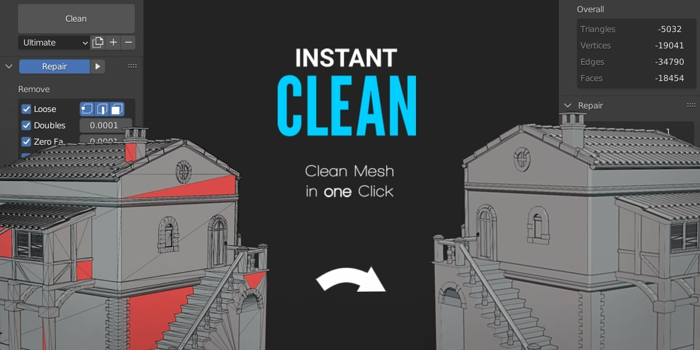

Instant Clean
=============

**Instant Clean** is a single click mesh clean addon for Blender.
Save yourself some time by automating the mesh clean process.

Features
--------

* Execute all mesh clean operations you can think of in one single click
* Create and manage presets for your preferred mesh clean setups
* Apply only operations of a single mesh clean category to solve a specific issue fast.

Support
-------

If you have any questions get in touch via :doc:`contact`.

Contents
--------

.. toctree::
   :maxdepth: 2

   installation
   clean
   categories
   presets
   update
   contact

| **Credits**
| 3D Model House: "XX century italian house" (https://skfb.ly/69S9R) by yarogor is licensed under Creative Commons Attribution (http://creativecommons.org/licenses/by/4.0/). The mesh was edited to demonstrate all features of Instant Clean in one use.
|